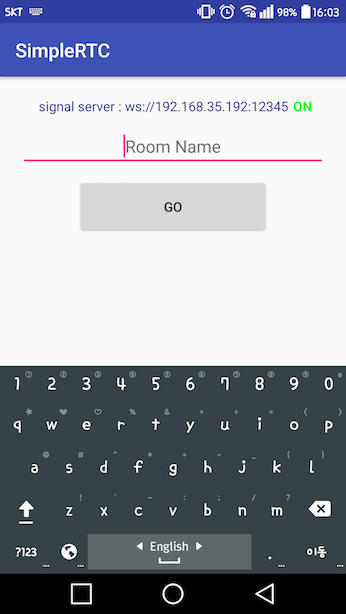
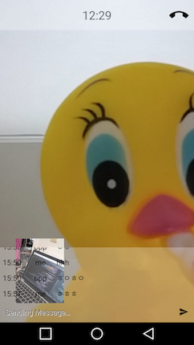
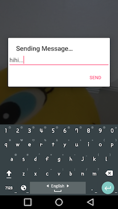
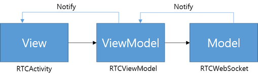
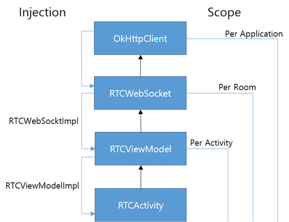

# Simple RTC Android app
간단한 [WebRTC](https://webrtc.org/) 안드로이드용 앱  
서버 : [simple-rtc-signaling-server](https://github.com/cchcc/simple-rtc-signaling-server)  


## setting
서버 주소를 `G.kt`파일에서 수정.
```kotlin
val SIGNAL_SERVER_ADDR = "ws://192.168.35.192:12345"
```  

## MVVM
  
Notify 방법은 [RxJava](https://github.com/ReactiveX/RxJava)를 이용

## Dependency Injection
  
[Kodein](https://github.com/SalomonBrys/Kodein) 이용
